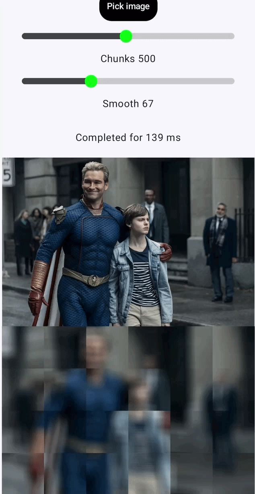

# Spatial Filters Android

Android app demonstrates the realizations of default algorithms of spatial filters.
It uses standard stack for better understanding (Kotlin, MVI, Coroutines).

1. Mean Filter ✅
   It replaces each pixel’s value with the average of itself and its surrounding neighbors.
   
2. Gaussian Filter ❗️
3. Median Filter❗️